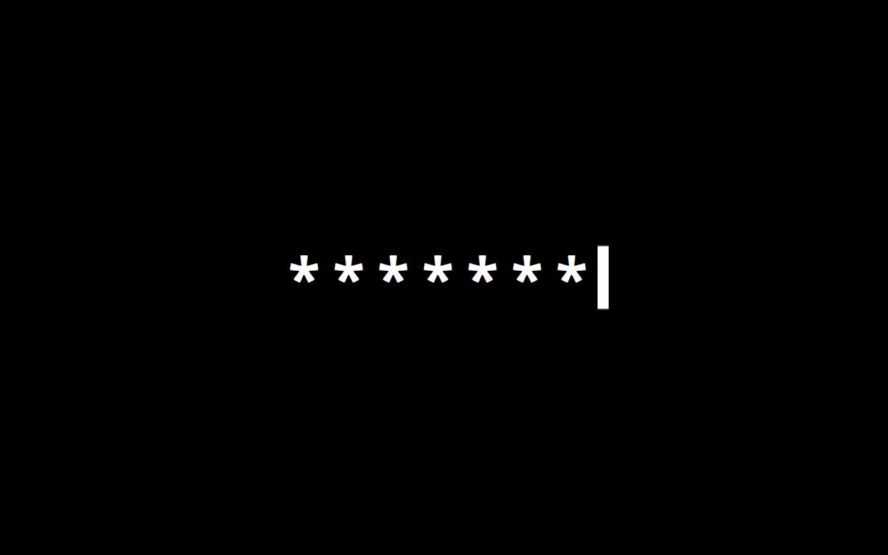
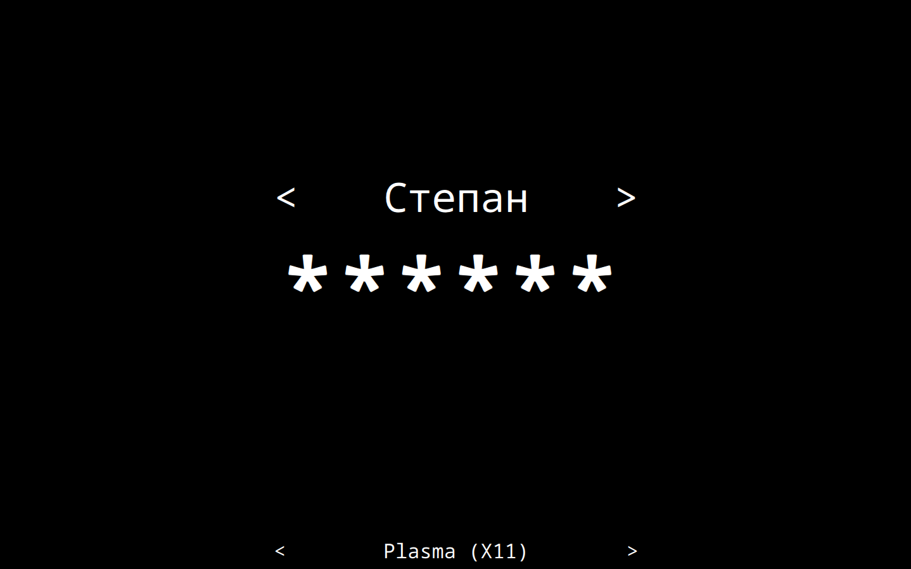
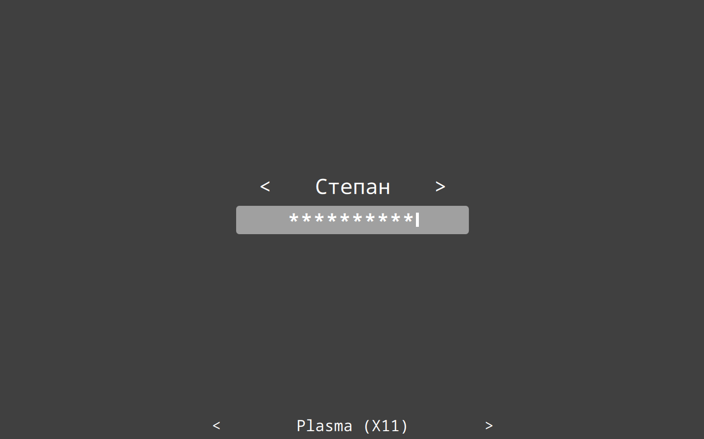
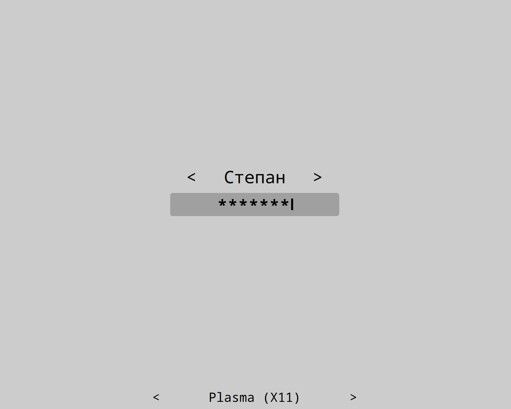
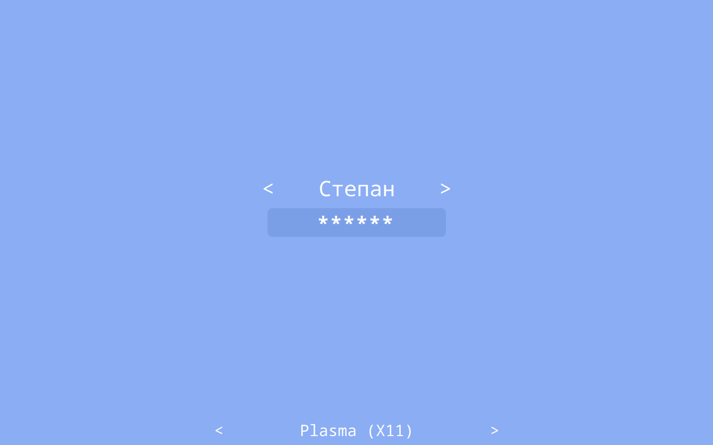
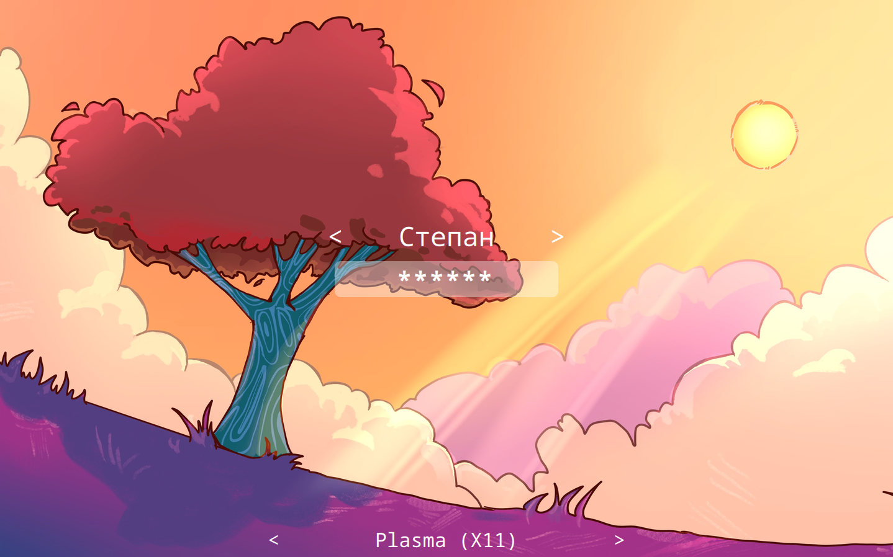
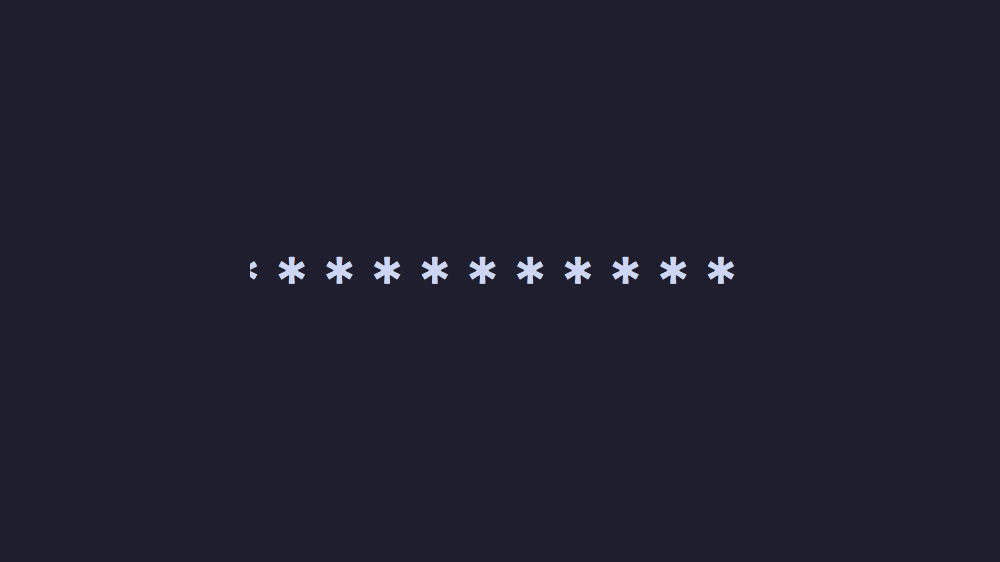
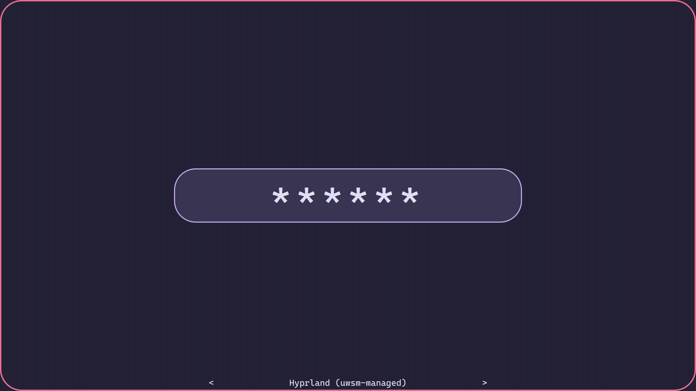
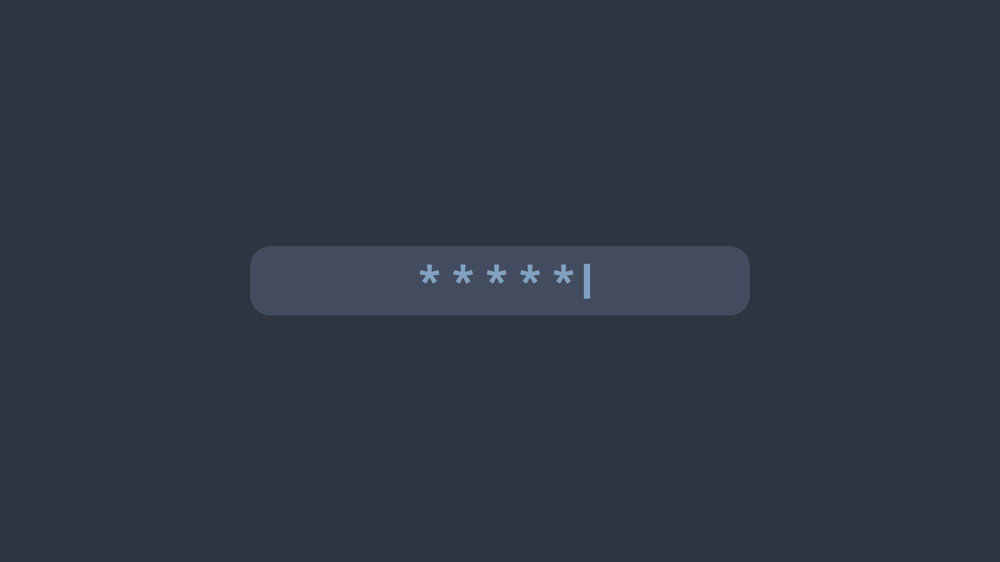

# Where is my SDDM theme?

## Source

[original GitHub repo](https://github.com/stepanzubkov/where-is-my-sddm-theme.git)

> The *most minimalistic* and *highly customizable* SDDM theme.
> Only black screen and password input field.
> Nothing extra, right?
> Even when you enter wrong password theme will show only red border around your screen.
> To login, just type your password and press `<Enter>` key.

## Installation

1. Copy [theme-name] folder to /usr/share/sddm/themes (`sudo cp -r [theme-name] /usr/share/sddm/themes`)
2. Open /etc/sddm.conf.d/[any new file name].conf
3. Change line `Current=...` to `Current=[theme-name]` under `[Theme]` header
4. Make sure this doesn't conflict with `/etc/sddm.conf` file or any other file in `/etc/sddm.conf.d/` directory

## Keymaps

`F2` or `Alt+u` - cycle select next user

`Ctrl+F2` or `Alt+Ctrl+u` - cycle select prev user

`F3` or `Alt+s` - cycle select next session

`Ctrl+F3` or `Alt+Ctrl+s` - cycle select prev session

`F10` - Suspend.

`F11` - Poweroff.

`F12` - Reboot.

`F1` - Show help message.


## Examples of customization

To install one of these configs, run inside theme directory:

```sh
cp <path to config>/theme.conf
```

If config based on image background, also copy image. For example:

```sh
cp example_configurations/tree.conf theme.conf
cp example_configurations/tree.png tree.png
```

| | |
| --- |--- |
| Classic (`where_is_my_sddm_theme/theme.conf`) | Classic, no cursor (`where_is_my_sddm_theme/example_configurations/classic_nocursor.conf`) |
|  |  |
| Grey (`where_is_my_sddm_theme/example_configurations/grey.conf`) | Light grey (`where_is_my_sddm_theme/example_configurations/lightgrey.conf`) |
|  |  |
| Blue (`where_is_my_sddm_theme/example_configurations/blue.conf`) |  Tree (`where_is_my_sddm_theme/example_configurations/tree.conf`) |
|  |  |
| Catppuccin (`https://github.com/catppuccin/where-is-my-sddm-theme`) | Rose-Pine Moon (`where_is_my_sddm_theme/example_configurations/rose-pine-moon.conf`) |
|  |  |
| Nord (`where_is_my_sddm_theme/example_configurations/nord.conf`) | |
|  | |

## Configuration

In `theme.conf` file you can find theme configuration.

Awailable settings:

`passwordcharacter=*` - Password mask character

`passwordMask=true` - Mask password characters or not ("true" or "false")

`passwordInputWidth=0.5` - value "1" is all display width, "0.5" is a half of display width etc.

`passwordInputBackground=` - Background color of password input

`passwordInputRadius=` - Radius of password input corners

`passwordInputCursorVisible=true` - "true" for visible cursor, "false"

`passwordFontSize=96` - Font size of password (in points)

`passwordCursorColor=random` - Color of password input cursor

`passwordTextColor=` - Color of password input text

`passwordAllowEmpty=false` - Allow blank password (e.g., if authentication is done by another PAM module)

`showSessionsByDefault=false` - Show or not sessions choose label

`sessionsFontSize=24` - Font size of sessions choose label (in points).

`showUsersByDefault=false` - Show or not users choose label

`showUserRealNameByDefault=true` - Show user real name on label by default

`usersFontSize=48` - Font size of users choose label (in points)

`background=` - Path to background image

`backgroundFill=#000000` - Background solid color, if you don't use background image

`backgroundFillMode=aspect` - Qt fill mode for background image. Must be one of: `aspect`, `fill`, `tile`, `pad`

`basicTextColor=#ffffff` - Default text color for all labels

`blurRadius=` - Radius for background blur. A larger radius increases the blur effect.

`hideCursor=` - Set to `true` to hide mouse cursor.

`cursorBlinkAnimation=true` - Enable or disable cursor blink animation ("true" or "false") **This option works only in Qt6**.

`font=monospace` - Default font

`helpFont=monospace` - Font of help message

`helpFontSize=18` - Font size of help message (in points)

## Disable virtual keyboard

You can disable virtual keyboard by setting line `InputMethod=qtvirtualkeyboard`
to `InputMethod=` in sddm config file. SDDM config is located in `/etc/sddm.conf`
(or `/etc/sddm.conf.d/kde_settings.conf`)
